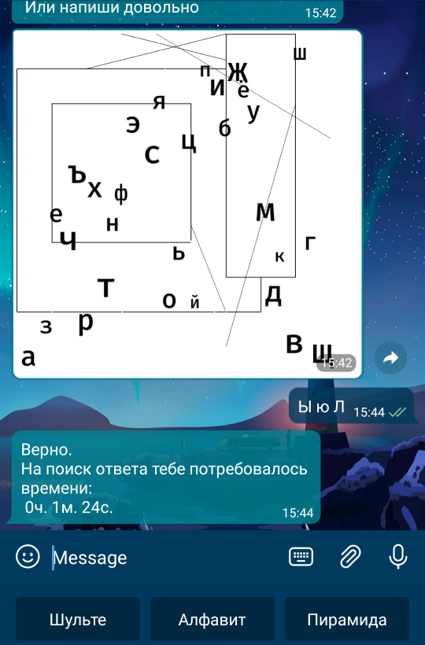
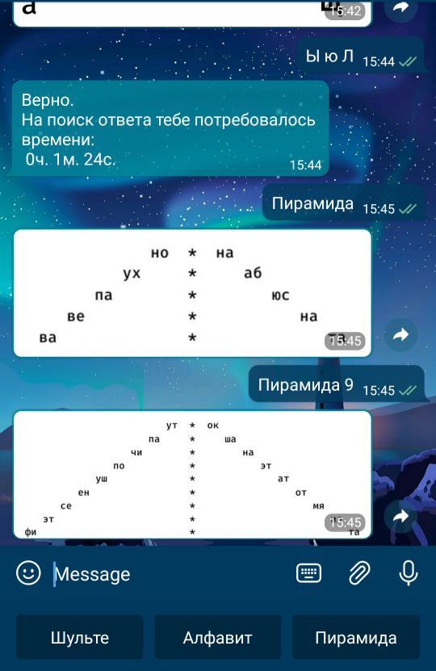

# Peripheral training bot

peripheral_training_bot - это бот для Telegram, который умеет присылать изображения
для тренировки периферийного зрения и памяти





### Установка

1. Клонируйте репозиторий, создайте виртуальное окружение
2. Установите зависимости `pip install -r requirements.txt`
3. Создайте файл .env и создайте в нем переменные:
    ```
    KEY = "Ключ вашего бота"
    PROXY_URL = "URL socks5-прокси"
    PROXY_USERNAME = "Username для авторизации на прокси"
    PROXY_PASSWORD = "Пароль  для авторизации на прокси"
    ```